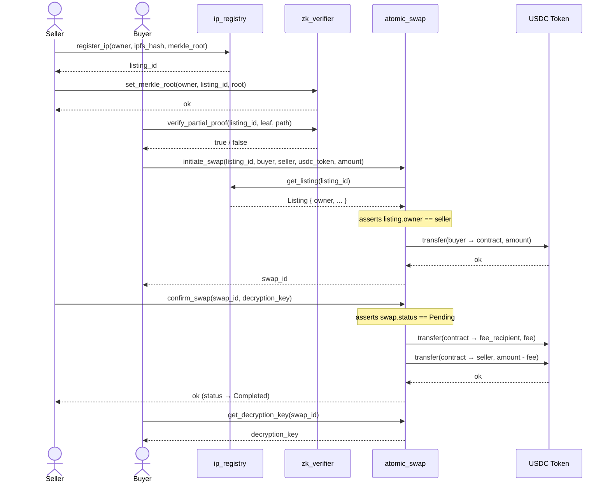
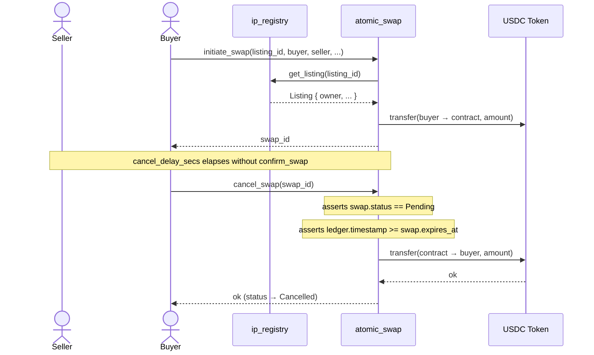

# Architecture: Sequence Diagrams

## Swap Lifecycle & ZK Proof Flow

The full happy-path flow spans three contracts: `ip_registry`, `zk_verifier`, and `atomic_swap`.

---

## Cancel / Refund Flow

If the seller never calls `confirm_swap` before the timeout, the buyer can reclaim their USDC.

